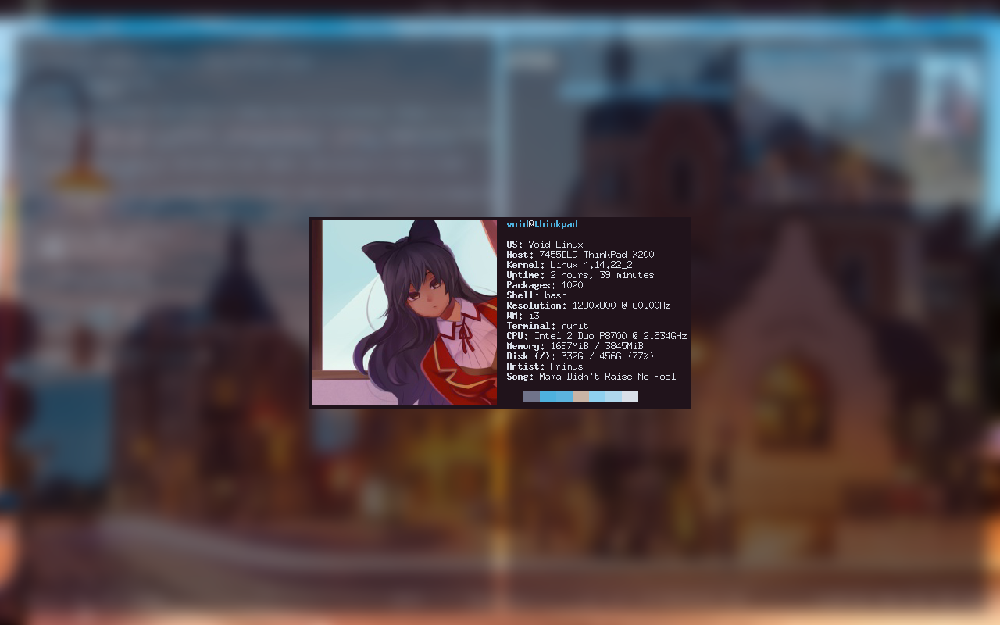

# About

A simple package that makes a blurry i3lock screen, but now with neofetch!

# Decencies

* i3lock
* neofetch
* scrot
* imagemagick

# Note

It will **not** work for you if you run it out-of-the-box, you're going to
have to fiddle with the internal settings, mainly your neofetch commands (I
have it pointing to an image on file), and whatever terminal you use.

I also recommend adding this line to your i3 config to make it look *much*
better

    for_window [instance='lock'] floating enable; focus floating

I have compton commands on there, but you can remove those or add whatever
composite manager you use. I like transparent terminals, but they don't look
great in this format. Also undermines the blur.

# Credit

Some of the imagemagick commands were taken from another script that for the
life of me I can't remember the name of, sorry :c
